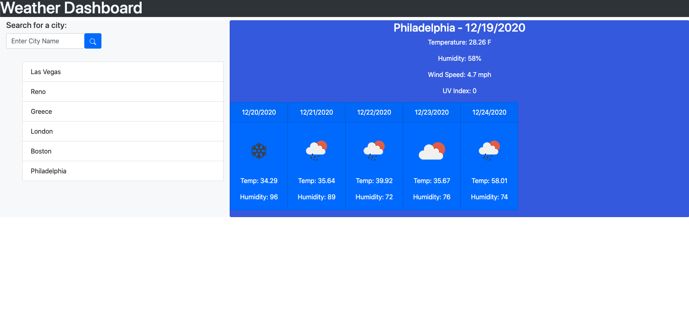

# Weather Dashboard

## Purpose

The purpose of the Weather Dashboard is to help you locate your city see it's current weather and its 5 day forecast. Giving you the opportunity to see the temperature, humidty, wind speed, and even the uv index.

## Tools

The tools used to create this website were:

- HTML
- CSS
- JAVASCRIPT
- BOOTSTRAP
- JQUERY
- MOMENT.JS

## Demo Picture

Here is an example of what happens when you search a city:

## Deployment

To see website, click [here](https://veroli-mart.github.io/weather-dashboard/)  

## Contribution

Made with &hearts; by Veronica Martinez
